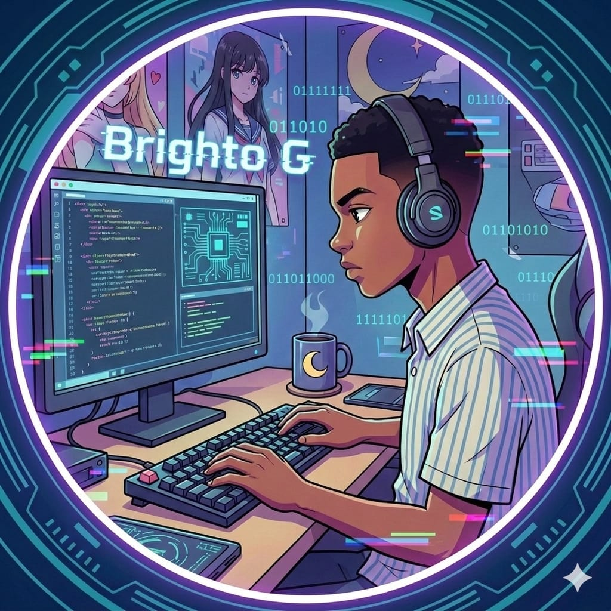

<div align="center">

# ⚡ Brighto G — Personal Portfolio

[](https://react.dev)
[](https://vitejs.dev)
[](https://tailwindcss.com)
[](https://vercel.com)
[](LICENSE)

**A sleek, terminal-inspired developer portfolio built to showcase projects, skills, and my journey as a Full-Stack Developer.**

[🌐 Live Demo](https://brighto-g.vercel.app) · [🐛 Report Bug](https://github.com/brighto7700/my_portfolio/issues) · [💡 Request Feature](https://github.com/brighto7700/my_portfolio/issues)



</div>

---

## 📖 About The Project

This repository contains the source code for my personal developer portfolio. Rather than reaching for a generic template, I designed this site from scratch to reflect both my aesthetic and my technical approach — a **deep space / dark mode** theme with neon yellow accents, high contrast, and zero compromises on performance.

---

## ✨ Features

| Feature | Description |
|---|---|
| ⚡ Blazing Fast | Bootstrapped with **Vite** — instant dev server and lightning-fast HMR |
| 🎨 Terminal-Inspired UI | Custom dark theme built from scratch with **Tailwind CSS** |
| 📱 Fully Responsive | Seamless layout across mobile, tablet, and desktop |
| 🔍 SEO & Rich Results | Open Graph meta tags + Google Knowledge Graph **JSON-LD** (`ProfilePage` schema) |
| ⌨️ Dynamic Interactions | Custom React typewriter effect + polished hover animations |

---

## 💻 Tech Stack

- **Framework:** React.js (v18)
- **Build Tool:** Vite
- **Styling:** Tailwind CSS + PostCSS
- **Icons:** Lucide React & Custom SVGs
- **Deployment:** Vercel

---

## 🚀 Getting Started

### Prerequisites

Make sure you have **Node.js ≥ 18** and **npm** installed.

```bash
node -v   # should be >= 18
npm -v
```

### Installation

```bash
# 1. Clone the repo
git clone https://github.com/brighto7700/my_portfolio.git

# 2. Navigate into the directory
cd my_portfolio

# 3. Install dependencies
npm install

# 4. Start the dev server
npm run dev
```

Open [http://localhost:5173](http://localhost:5173) in your browser. 🎉

### Available Scripts

| Command | Description |
|---|---|
| `npm run dev` | Start local development server |
| `npm run build` | Build for production |
| `npm run preview` | Preview the production build locally |

---

## 🌐 SEO & Meta Configuration

If you fork this repo for your own portfolio, update the following:

- [ ] Replace `public/profile_pic.png` with your own Open Graph image (recommended: **1200 × 630px**)
- [ ] Update the **JSON-LD structured data** in `index.html` with your personal links and domain
- [ ] Update the **canonical URL** and **meta descriptions** in `<head>`
- [ ] Update the `siteName` and `author` fields throughout

---

## 📁 Project Structure

```
my_portfolio/
├── public/
│   └── og-main.png          # Open Graph image
├── App.jsx                  # Root component
├── globals.css              # Global styles
├── index.html               # Entry point + SEO meta/JSON-LD
├── tailwind.config.js
├── postcss.config.js
└── package.json
```

---

## 📫 Let's Connect

<div align="center">

[](mailto:brighto7700@gmail.com)
[](https://github.com/brighto7700)
[](https://linkedin.com/in/brighto7700)
[](https://forem.dev/brighto7700)

</div>

---

<div align="center">

Designed & Built with ❤️ by **Bright Emmanuel** © 2026

*If this project inspired you, consider dropping a ⭐ — it means a lot!*

</div>
